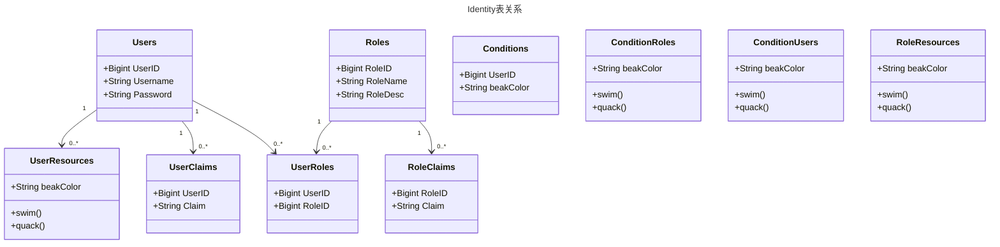

# 身份模块

## 概述

基于微软的Identity 模型进行拓展

## 微软的Identity 模型

1. **用户表（Users）：** 存储用户信息。

   | 列名     | 数据类型 | 主键 | 自增 | 其他属性 |
   | -------- | -------- | ---- | ---- | -------- |
   | UserID   | BIGINT   | 是   | 是   |          |
   | Username | NVARCHAR |      |      |          |
   | Password | NVARCHAR |      |      |          |
   | ...      | ...      |      |      |          |

2. **角色表（Roles）：** 存储角色信息。

   | 列名     | 数据类型 | 主键 | 自增 | 其他属性 |
   | -------- | -------- | ---- | ---- | -------- |
   | RoleID   | BIGINT   | 是   | 是   |          |
   | RoleName | NVARCHAR |      |      |          |
   | RoleDesc | NVARCHAR |      |      |          |
   | ...      | ...      |      |      |          |

3. **角色声明表（RoleClaim）：** 存储向角色中所有用户授予的声明。

   | 列名   | 数据类型 | 主键 | 自增 | 其他属性 |
   | ------ | -------- | ---- | ---- | -------- |
   | RoleID | BIGINT   | 是   | 是   |          |
   | Claim  | NVARCHAR |      |      |          |
   | ...    | ...      |      |      |          |

4. **用户声明表（UserClaim）：** 存储用户拥有的声明。

   | 列名   | 数据类型 | 主键 | 外键 | 其他属性 |
   | ------ | -------- | ---- | ---- | -------- |
   | UserID | BIGINT   |      | 是   |          |
   | Claim  | NVARCHAR |      | 是   |          |

5. **用户角色关联表（UserRole）：** 存储用户与角色之间的关联。

   | 列名   | 数据类型 | 主键 | 外键 | 其他属性 |
   | ------ | -------- | ---- | ---- | -------- |
   | UserID | BIGINT   |      | 是   |          |
   | RoleID | BIGINT   |      | 是   |          |

## 拓展部分

1. **条件表（Conditions）：** 存储条件信息。

   | 列名         | 数据类型 | 主键 | 自增 | 其他属性 |
   | ------------ | -------- | ---- | ---- | -------- |
   | ConditionID  | BIGINT   | 是   | 是   |          |
   | ConditionKey | NVARCHAR |      |      |          |
   | ConditionVal | NVARCHAR |      |      |          |
   | ...          | ...      |      |      |          |

2. **条件角色关联表（ConditionRole）：** 存储条件与角色之间的关联。

   | 列名        | 数据类型 | 主键 | 外键 | 其他属性 |
   | ----------- | -------- | ---- | ---- | -------- |
   | ConditionID | BIGINT   |      | 是   |          |
   | RoleID      | BIGINT   |      | 是   |          |
   | ...         | ...      |      |      |          |

3. **条件用户关联表（ConditionUser）：** 存储条件与用户之间的关联。

   | 列名        | 数据类型 | 主键 | 外键 | 其他属性 |
   | ----------- | -------- | ---- | ---- | -------- |
   | ConditionID | BIGINT   |      | 是   |          |
   | UserID      | BIGINT   |      | 是   |          |
   | ...         | ...      |      |      |          |

4. **用户资源关联表（UserResource）：** 存储用户拥有的资源。

   | 列名         | 数据类型 | 主键 | 外键 | 其他属性 |
   | ------------ | -------- | ---- | ---- | -------- |
   | ResourceID   | BIGINT   |      | 是   |          |
   | UserID       | BIGINT   |      | 是   |          |
   | ResourceType | INT      |      | 是   |          |
   | ...          | ...      |      |      |          |

5. **角色资源关联表（RoleResource）：** 存储向角色中所有用户授予资源。

   | 列名         | 数据类型 | 主键 | 外键 | 其他属性 |
   | ------------ | -------- | ---- | ---- | -------- |
   | ResourceID   | BIGINT   |      | 是   |          |
   | RoleID       | BIGINT   |      | 是   |          |
   | ResourceType | INT      |      | 是   |          |
   | ...          | ...      |      |      |          |

## 设计图
### UML

### 类图

### 流程图

###