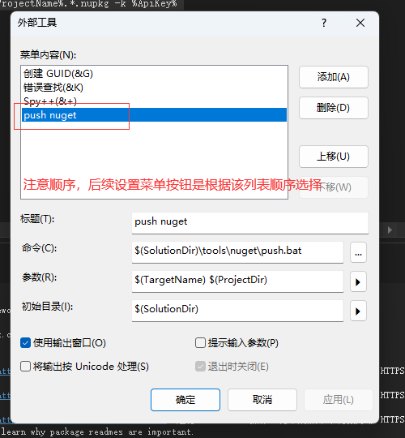

# vs自动打包并推送项目包

## 核心脚本

```bat
::vs中的参数
set ProjectName=%~1
set ProjectDir=%~2
::Nuget密钥
set ApiKey=123456
::发布方式
set PublishMode=Release
::发布地址
set SourceUrl=http://localhost:5000/v3/index.json
::核心逻辑
del %ProjectDir%bin\%PublishMode%\%ProjectName%.*.nupkg /F /Q
dotnet pack %ProjectDir%%ProjectName%.csproj -c %PublishMode%
dotnet nuget push -s http://localhost:5000/v3/index.json %ProjectDir%bin\%PublishMode%\%ProjectName%.*.nupkg -k %ApiKey%
del %ProjectDir%bin\%PublishMode%\%ProjectName%.*.nupkg /F /Q
```

## vs的设置

外部工具


外部工具配置

图中参数解释：
$(xxx)为vs提供的处理内容，详细请查看参数输入框右边的三角符号
参数一栏，可输入多个参数，用空格隔开，BAT文件就可以分别按顺序接收



自定义菜单


自定义菜单配置1


自定义菜单配置2


效果


## 注意事项

vs控制台乱码是由于控制台的编码不支持中文，请自行寻找解决方案，直接解决方案修改系统的区域配置

win 11/10为例

位置：时间和语言=>区域和语言=>管理语言设置=>非Unicode程序的语言=>更改系统区域设置=>勾上Beta 版选项=>重启计算机